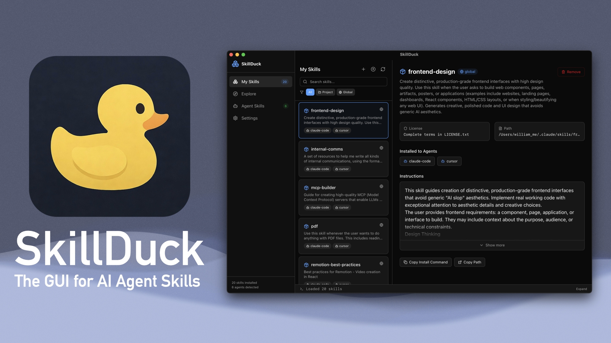
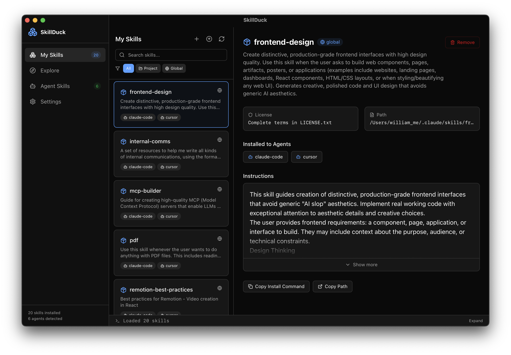
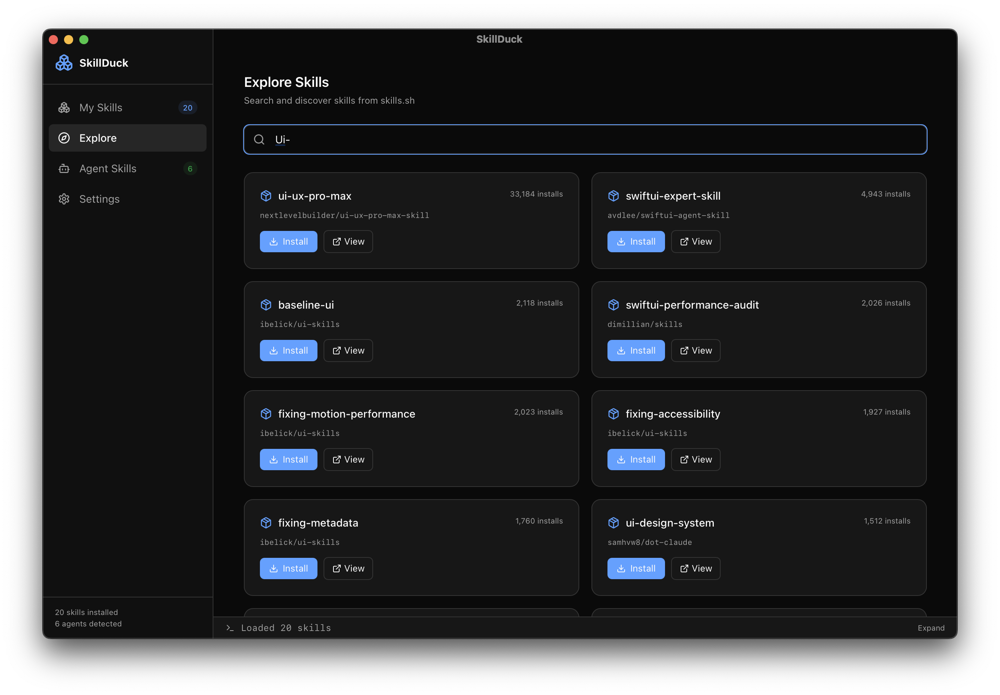
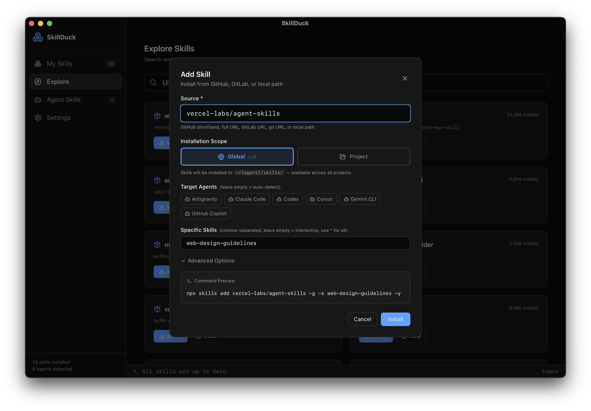
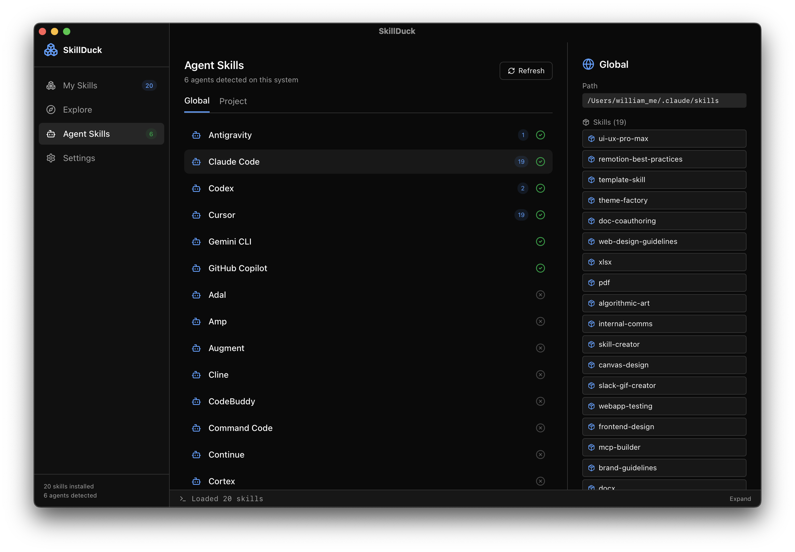

<div align="center">
  

  **The GUI for AI Agent Skills**

  [](https://github.com/william-zheng-tw/skillduck/releases)
  [](https://tauri.app)
  [](LICENSE)
  [](https://github.com/william-zheng-tw/skillduck/releases)
</div>

A desktop GUI for managing [Agent Skills](https://agentskills.io) — the open format for packaging reusable AI agent capabilities.

Built on [vercel-labs/skills](https://github.com/vercel-labs/skills) CLI with a Tauri 2.0 + React 19 stack.

## Screenshots

<table>
  <tr>
    <td><br><b>My Skills</b> — View and manage installed skills</td>
    <td><br><b>Explore</b> — Browse community skills</td>
  </tr>
  <tr>
    <td><br><b>Install</b> — One-click install to any agent</td>
    <td><br><b>Agent Skills</b> — Cross-agent management</td>
  </tr>
</table>

## Features

### My Skills
- List all installed skills (project + global scope)
- Search, filter by scope (project/global)
- View skill details, metadata, installed agents
- Install/remove skills via CLI bridge

### Explore
- Browse featured skills from the community
- One-click install from the dashboard
- Links to [skills.sh](https://skills.sh) for the full directory

### Agents
- Auto-detect 18+ supported agents (Cursor, Claude Code, Codex, etc.)
- View per-agent skill installation status
- Cross-agent skill management

### Editor
- YAML frontmatter form with real-time validation
- Markdown body editor with live preview (split pane)
- Full [agentskills.io specification](https://agentskills.io/specification) compliance checking
- Token counter and progressive disclosure stage preview

### Sandbox
- Isolated test environment for skills
- Three-stage progressive disclosure simulation
- Script execution in sandboxed environment
- Token usage estimation per stage

## Tech Stack

| Layer | Technology |
|-------|-----------|
| Desktop Framework | Tauri 2.0 (Rust backend) |
| Frontend | React 19 + TypeScript |
| Styling | Tailwind CSS 4 |
| Icons | Lucide React |
| State | Zustand |
| Data Fetching | TanStack Query |
| Markdown | react-markdown + remark-gfm |
| File Scanning | walkdir (Rust) |
| YAML Parsing | serde_yaml (Rust) |
| File Watching | notify (Rust) |
| CLI Bridge | tokio async process spawning |

## Prerequisites

- [Node.js](https://nodejs.org/) >= 18
- [Rust](https://rustup.rs/) (stable toolchain)
- System WebView (built-in on macOS/Windows, WebKitGTK on Linux)

## Installation

**Requires macOS with Apple Silicon (M1/M2/M3/M4)**

### One-line install (recommended)

```bash
curl -fsSL https://raw.githubusercontent.com/william-zheng-tw/skillduck/main/install.sh | bash
```

**What this script does:**
1. Downloads the latest SkillDuck DMG from GitHub Releases
2. Copies `SkillDuck.app` to `/Applications`
3. Runs `xattr -dr com.apple.quarantine /Applications/SkillDuck.app`
4. Cleans up the temporary DMG file

**About step 3 — the quarantine removal:**

macOS automatically marks any file downloaded from the internet with a quarantine attribute. For apps that are not notarized with Apple, this causes macOS to block the app with an "app is damaged" error.

`xattr -dr com.apple.quarantine` removes only that quarantine flag — it does not disable Gatekeeper, modify system settings, or grant any additional permissions to the app. The app still runs in the standard macOS sandbox.

SkillDuck is not yet notarized because it requires an Apple Developer account ($99/year). You can [review the full install script](https://github.com/william-zheng-tw/skillduck/blob/main/install.sh) before running it.

### Manual install

1. Download the DMG from [Releases](https://github.com/william-zheng-tw/skillduck/releases)
2. Open the DMG and drag **SkillDuck.app** to `/Applications`
3. Remove the quarantine attribute:
   ```bash
   xattr -dr com.apple.quarantine /Applications/SkillDuck.app
   ```

## Uninstall

```bash
curl -fsSL https://raw.githubusercontent.com/william-zheng-tw/skillduck/main/uninstall.sh | bash
```

Removes `SkillDuck.app` from `/Applications` and cleans up app data. Will prompt for confirmation before deleting anything.

## Development

```bash
# Install dependencies
npm install

# Run in development mode
npm run tauri dev

# Build for production
npm run tauri build
```

## Architecture

<details>
<summary>Project structure and CLI communication details</summary>

```
skillduck/
├── src/                      # Frontend (React)
│   ├── components/
│   │   ├── layout/           # Shell, Sidebar, StatusBar
│   │   ├── skills/           # SkillCard, SkillDetail
│   │   ├── editor/           # (extensible)
│   │   ├── agents/           # (extensible)
│   │   └── explorer/         # (extensible)
│   ├── hooks/                # useStore (Zustand)
│   ├── lib/                  # tauri invoke wrappers, utils
│   ├── pages/                # SkillsPage, AgentsPage, EditorPage, etc.
│   └── types/                # TypeScript type definitions
├── src-tauri/                # Backend (Rust)
│   └── src/
│       ├── commands/
│       │   ├── skills.rs     # File scanning, YAML parsing
│       │   ├── agents.rs     # Agent detection (18+ agents)
│       │   ├── editor.rs     # Read/write/validate SKILL.md
│       │   ├── cli_bridge.rs # npx skills CLI wrapper
│       │   ├── sandbox.rs    # Isolated test environment
│       │   └── watcher.rs    # File system change watcher
│       └── lib.rs            # Tauri command registration
├── package.json
└── README.md
```

### CLI Communication Strategy

The app uses a **hybrid approach**:

- **Direct Rust** (fast, for read operations): file scanning, YAML parsing, validation, agent detection
- **CLI Bridge** (for complex write operations): `npx skills add/remove/update/check/init`

### File System Paths

Scans these agent skill directories:

| Agent | Project Path | Global Path |
|-------|-------------|-------------|
| Cursor | `.cursor/skills/` | `~/.cursor/skills/` |
| Claude Code | `.claude/skills/` | `~/.claude/skills/` |
| Codex | `.agents/skills/` | `~/.codex/skills/` |
| ... | ... | ... |

See `src-tauri/src/commands/agents.rs` for the full list.

</details>

## License

MIT
